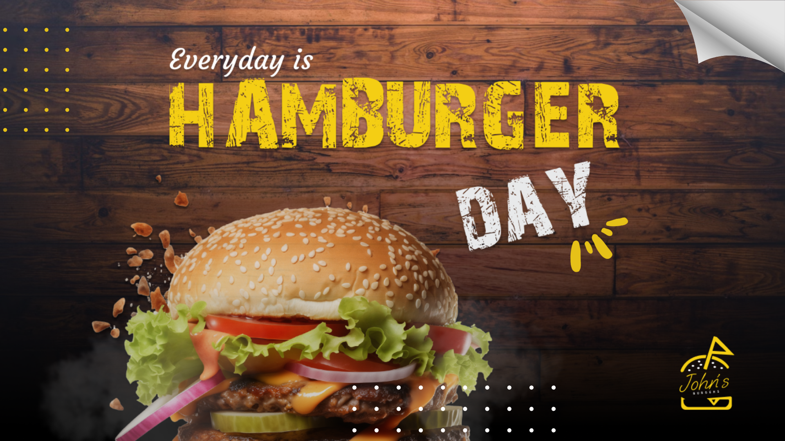
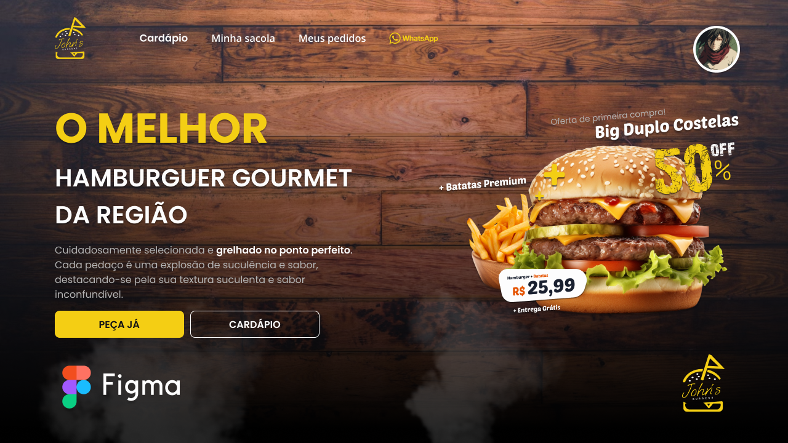
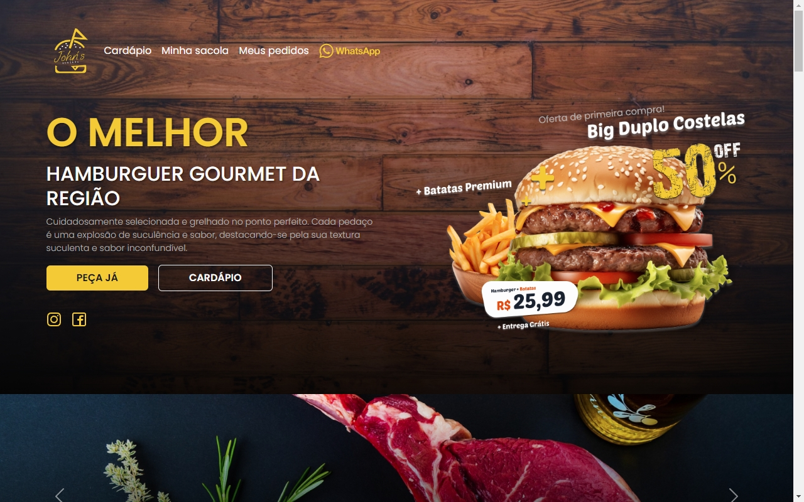
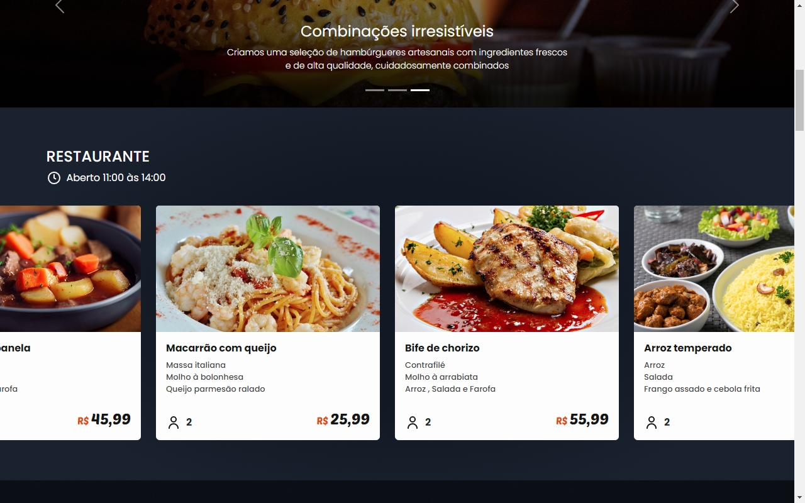
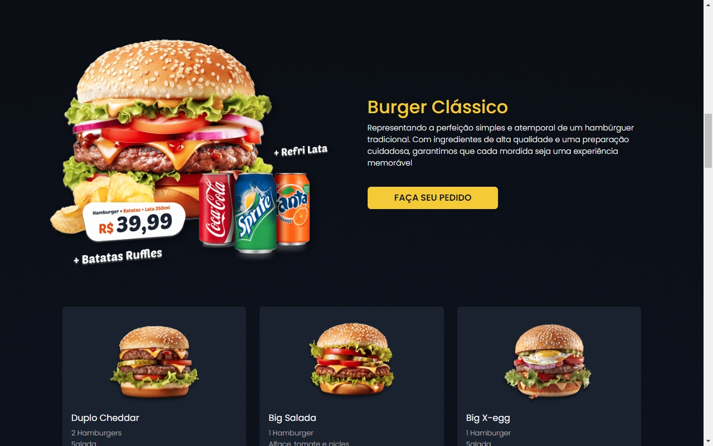
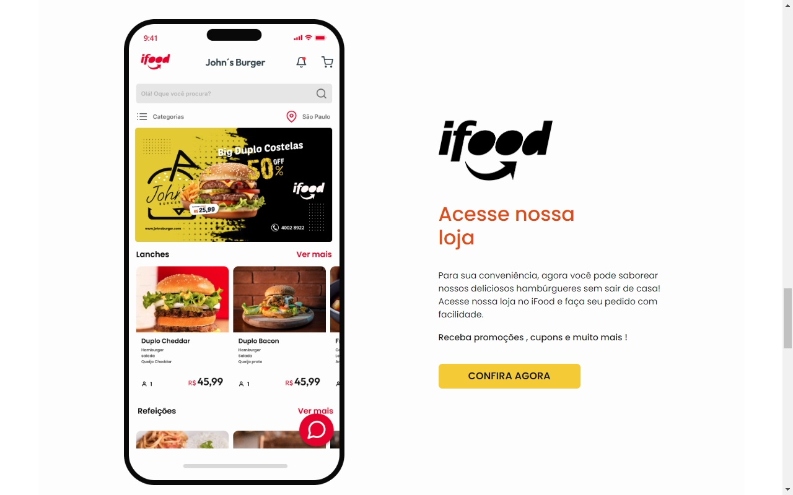
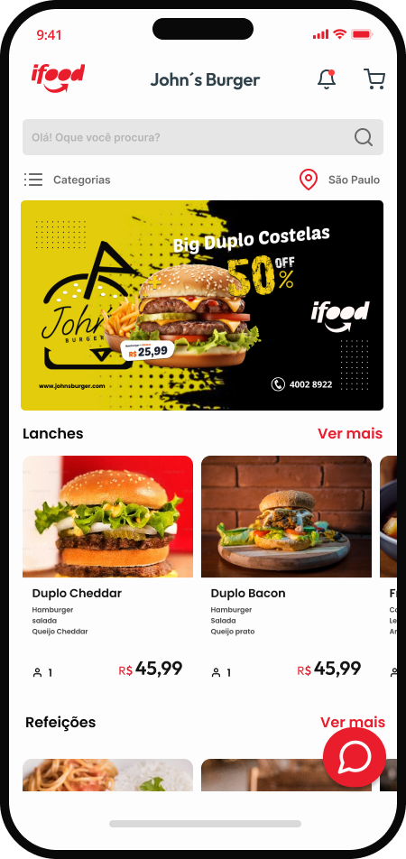

# John´s Burgers

<div align="left">
  
  
  
    

  
  
  
        
  
    
  
  
  
</div>

###



> Página que criei com o tema de Hamburgueria usando BootStrap, framework CSS que me garantiu uma produção rápida e responsiva .

## 🚀 Instalando

Windows:

```
git clone https://github.com/Joaommsp/johns-burger.git
```

```
cd johns-burger
```

```
npm i
```

```
npm run dev
```

## ✏️ Protótipo e Design

<Mockup>Confira o design do projeto feito no Figma

<a  href="https://www.figma.com/design/f8UsUmCg3jb6Yl81SQ12Q9/John%C2%B4s-burger?node-id=0-1&t=65A53hCkWf62Y7yl-1" >
  
</a>

> Clique na imagem para ser encaminhado

## 💻 Um pouco do projeto









## 📱 Mockup

<p>Pelo Figma desenvolvi este MockUp para complementar o projeto</p>



## 🔗 Deploy

Clique e acesse o projeto

<div align="left">
 <a href="https://johns-burger.vercel.app/"></a>
</div>

## ⭐ Metas

- [x] Uma página viva e elegante
- [x] Design Responsivo
- [x] Deploy no Vercel
- [x] Utilização do BootStrap

## 🛠️ BootStrap

<p>Para quem ainda não conhece , recomendo muito conhecer o Bootstrap, é fácil de aprender e usar. Ele oferece uma ampla gama de componentes prontos, como botões, formulários, e barras de navegação, que você pode simplesmente adicionar ao seu projeto sem escrever muito código.<p>

## ⚠️ Única desvantagem

<p>Os componentes padrão do Bootstrap são amplamente utilizados, o que pode fazer com que seu site tenha uma aparência genérica e similar a muitos outros sites. Personalizar os componentes para criar um design único pode exigir um esforço adicional.</p>

Clique e acesse a documentação

<div align="left">
 <a href="https://getbootstrap.com/docs/5.3/getting-started/introduction/"></a>
</div>

## 🤓 Me acompanhe para mais projetos
